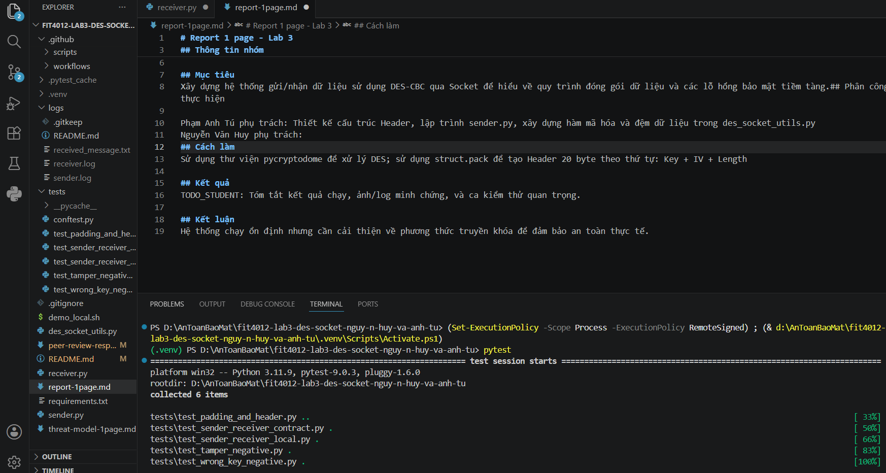

# Report 1 page - Lab 3

## Thông tin nhóm
- Thành viên 1: Phạm Anh Tú
- Thành viên 2: Nguyễn Văn Huy

## Mục tiêu
Xây dựng hệ thống gửi/nhận dữ liệu sử dụng DES-CBC qua Socket để hiểu về quy trình đóng gói dữ liệu và các lỗ hổng bảo mật tiềm tàng.## Phân công thực hiện

Phạm Anh Tú phụ trách: Thiết kế cấu trúc Header, lập trình sender.py, xây dựng hàm mã hóa và đệm dữ liệu trong des_socket_utils.py
Nguyễn Văn Huy phụ trách:
## Cách làm
Sử dụng thư viện pycryptodome để xử lý DES; sử dụng struct.pack để tạo Header 20 byte theo thứ tự: Key + IV + Length

## Kết quả
Tóm tắt kết quả chạy, ảnh/log minh chứng, và ca kiểm thử quan trọng.

## Kết luận
Hệ thống chạy ổn định nhưng cần cải thiện về phương thức truyền khóa để đảm bảo an toàn thực tế.